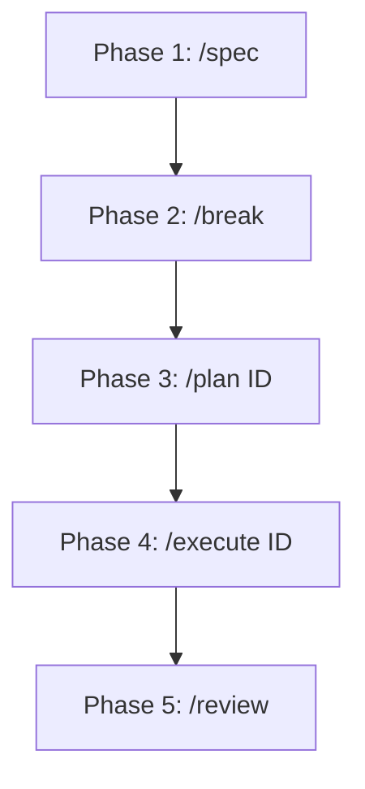

# Contributing Guide 🤝

> [Ir para documentação de contributing em PT-BR](https://github.com/rafacdomin/design-system/blob/main/CONTRIBUTING_PT-BR.md)

Welcome to the **Design System** project. To maintain the integrity, consistency, and technical compliance of the entire codebase, all contributors (developers and AI agents) must strictly follow the guidelines and absolute rules described below.

---

## 🔄 Workflow (Spec-Driven Development)

We adopt the **Spec-Driven Development** methodology to guide the evolution of the design system through 5 mandatory and sequential phases:



1. **Phase 1: Specification (`/spec`)**
   - Creation or update of the `SPEC.md` file, consolidating all component API specifications, dynamic behavior, and design rules.
2. **Phase 2: Decomposition (`/break`)**
   - Breaking down the specifications of `SPEC.md` into granular tasks (executable issues) saved individually in the `.epic/issues/` folder and tracked in the central roadmap `.epic/EPIC_DESIGN_SYSTEM.md`.
3. **Phase 3: Refinement and Research (`/plan [ID]`)**
   - Researching references and ARIA accessibility for the specific issue. Generation of a detailed implementation checklist of 15 to 20 items, updated directly in the issue's markdown file.
4. **Phase 4: Implementation (`/execute [ID]`)**
   - Writing the actual code, strictly applying the development rules and focusing on the TDD cycle.
5. **Phase 5: Review (`/review`)**
   - Strict audit of the completed code against the general guidelines, ensuring that no technical compliance regressions occur.

---

## 🚫 Absolute Rules (Never Violate)

For any modification or component to be accepted into the repository, it **must** meet these 9 rules without exception:

1. **Standard File Structure:** Every component created under the `@ds/core` package must have exactly the following files in its folder:
   - `ComponentName.tsx` (Implementation with forwardRef)
   - `ComponentName.test.tsx` (Unit and accessibility tests)
   - `ComponentName.module.scss` (Isolated styles)
   - `index.ts` (Unified export)
2. **Testing Before Implementation (TDD):** Unit and accessibility tests (`.test.tsx`) must be written **before** the component implementation code. They must run and fail initially.
3. **Integrated WCAG 2.1 AA Accessibility:** Every component must pass without any violations in automated `jest-axe` tests and have full keyboard and screen reader support (ARIA).
4. **Zero `any` in TypeScript:** Using the `any` type in variables, signatures, mocks, or assertions is strictly prohibited. Use strict explicit types or `unknown` for dynamic typings.
5. **Exclusive Typing via Interface:** Component props and public interfaces must use `interface`, never `type` alias.
6. **Unified Exports:** Internal elements and secondary components must not be exposed directly. The component's `index.ts` must export only the main public API.
7. **Theming via Context:** Colors and styles must respond to the theme through the `withTheme` HOC or CSS Custom Properties. Hardcoding colors/hexadecimal values is prohibited.
8. **SCSS Without Literals:** `.module.scss` files must exclusively consume Custom Properties declared in the tokens (e.g., `var(--ds-color-neutral-0)`).
9. **Compound Component Pattern via `Object.assign`:** Coupled subcomponents must be defined internally and indexed at the main component's root (e.g., `Dropdown.Item = DropdownItemComponent`). The `displayName` of each subcomponent must follow exactly the hierarchical namespace format (e.g., `'Dropdown.Item'`).

---

## 🛠️ Step-by-Step Development Guide

### 1. Environment Preparation

Install the dependencies using `pnpm`:

```bash
pnpm install
```

### 2. Development Sandbox (Storybook)

Start Storybook locally to inspect components in real time:

```bash
pnpm storybook
```

The server will be accessible at `http://localhost:6006`.

### 3. Running Unit and Accessibility Tests

Run the local test suite with Vitest:

```bash
pnpm test
```

### 4. Running Visual Tests Locally

Local visual tests run against the static build of Storybook.
Whenever you make changes to components or create new stories, generate the static build of Storybook and run the visual regression validations:

```bash
pnpm build
pnpm test:visual
```

### 5. Updating Image Snapshots (Baselines)

If the visual changes are intentional and approved, update the local reference images by running:

```bash
pnpm test:visual:update
```

### 6. Execution in CI (BrowserStack)

To validate components on real browsers in a remote environment (Windows 11 and macOS), configure the environment credentials and run:

```bash
export BROWSERSTACK_USERNAME="your-username"
export BROWSERSTACK_ACCESS_KEY="your-access-key"
pnpm test:visual
```

### 7. Continuous Integration & Publishing

The repository is configured with GitHub Actions pipelines for checks and deliveries.
The workflows added in this project are triggered manually through `workflow_dispatch`, and the Storybook deployment runs via `workflow_run` and/or manual execution rather than automatically on pushes to `main` or release tags.

For detailed steps on workflow configurations, package builds, and manual execution triggers, refer to the [Publishing & CI/CD Guide (PUBLISHING.md)](https://github.com/rafacdomin/design-system/blob/main/PUBLISHING.md).

---

## 📝 Git & Commit Standardization

We adopt the **Conventional Commits** specification:

- **Format:** `<type>(scope): <description>`
- **Common types:**
  - `feat`: New component or feature.
  - `fix`: Bug fix in component style or behavior.
  - `docs`: Modifications to documentation files (like this file).
  - `style`: Formatting or cosmetic code changes (no logical impact).
  - `refactor`: Changes that improve code structure without changing behavior.
  - `test`: Addition or modification of unit/visual tests.
  - `chore`: Updates to dependencies and tooling.

### Pre-Commit Validation

The project uses **Husky** along with **lint-staged**. On every commit attempt:

1. Prettier formats the modified files.
2. ESLint validates TypeScript quality rules.
3. If there is any compilation error or typing warning, the commit is automatically aborted.
