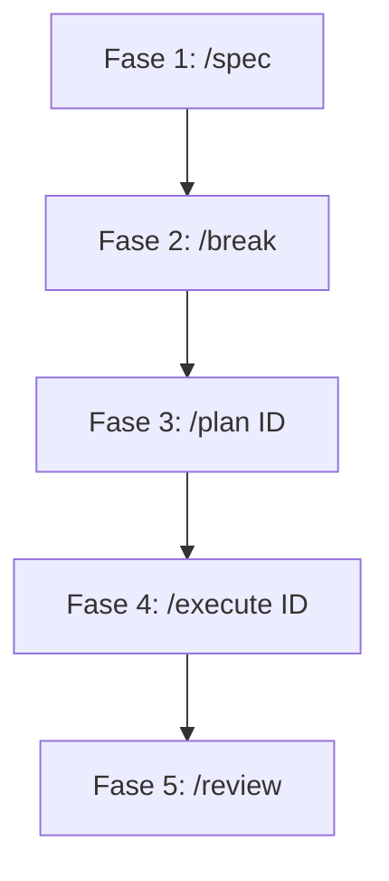

# Guia de Contribuição 🤝

> [Go to contributing documentation in EN-US](https://github.com/rafacdomin/design-system/blob/main/CONTRIBUTING.md)

Seja bem-vindo ao projeto do **Design System**. Para manter a integridade, consistência e conformidade técnica de toda a base de código, todos os contribuidores (desenvolvedores e agentes de IA) devem seguir rigorosamente as diretrizes e regras absolutas descritas abaixo.

---

## 🔄 Fluxo de Trabalho (Spec-Driven Development)

Adotamos a metodologia **Spec-Driven Development** para guiar a evolução do design system através de 5 fases obrigatórias e sequenciais:



1. **Fase 1: Especificação (`/spec`)**
   - Criação ou atualização do arquivo `SPEC.md` consolidando todas as especificações das APIs dos componentes, comportamento dinâmico e regras de design.
2. **Fase 2: Decomposição (`/break`)**
   - Quebra das especificações do `SPEC.md` em tarefas granulares (issues executáveis) salvas individualmente na pasta `.epic/issues/` e controle no roadmap central `.epic/EPIC_DESIGN_SYSTEM.md`.
3. **Fase 3: Refinamento e Pesquisa (`/plan [ID]`)**
   - Pesquisa de referências e acessibilidade ARIA para a issue específica. Geração de um checklist de implementação detalhado de 15 a 20 itens atualizado diretamente no arquivo markdown da issue.
4. **Fase 4: Implementação (`/execute [ID]`)**
   - Escrita de código propriamente dita, aplicando estritamente as regras de desenvolvimento e focando no ciclo de TDD.
5. **Fase 5: Revisão (`/review`)**
   - Auditoria estrita do código finalizado contra as diretrizes gerais, garantindo que não ocorram regressões de conformidade técnica.

---

## 🚫 Regras Absolutas (Nunca Violar)

Para que qualquer modificação ou componente seja aceito no repositório, ele **deve** atender a estas 9 regras sem exceção:

1. **Estrutura Padrão de Arquivos:** Todo componente criado sob o pacote `@rafacdomin/ds-core` deve possuir exatamente os seguintes arquivos em sua pasta:
   - `ComponentName.tsx` (Implementação com forwardRef)
   - `ComponentName.test.tsx` (Testes unitários e de acessibilidade)
   - `ComponentName.module.scss` (Estilos isolados)
   - `index.ts` (Export unificado)
2. **Testes Antes da Implementação (TDD):** Os testes unitários e de acessibilidade (`.test.tsx`) devem ser escritos **antes** do código de implementação do componente. Eles devem rodar e falhar inicialmente.
3. **Acessibilidade WCAG 2.1 AA Integrada:** Todo componente deve passar sem nenhuma violação nos testes automatizados do `jest-axe` e possuir suporte total a teclado e leitores de tela (ARIA).
4. **Zero `any` no TypeScript:** É estritamente proibido o uso da tipagem `any` em variáveis, assinaturas, mocks ou asserções. Use tipos explícitos rígidos ou `unknown` para tipagens dinâmicas.
5. **Tipagem Exclusiva via Interface:** Props de componentes e interfaces públicas devem usar `interface`, nunca `type` alias.
6. **Exportações Unificadas:** Elementos internos e componentes secundários não devem ser expostos diretamente. O `index.ts` do componente deve exportar apenas a API pública principal.
7. **Temas via Contexto:** Cores e estilos devem responder ao tema através do HOC `withTheme` ou de CSS Custom Properties. É proibido fixar valores/hexadecimais hardcoded.
8. **SCSS Sem Literais:** Arquivos `.module.scss` devem consumir exclusivamente as Custom Properties declaradas nos tokens (ex: `var(--ds-color-neutral-0)`).
9. **Compound Component Pattern via `Object.assign`:** Subcomponentes acoplados devem ser definidos internamente e indexados na raiz do componente principal (ex: `Dropdown.Item = DropdownItemComponent`). O `displayName` de cada subcomponente deve seguir exatamente o formato de namespace hierarchico (ex: `'Dropdown.Item'`).

---

## 🛠️ Guia de Desenvolvimento Passo a Passo

### 1. Preparação do Ambiente

Instale as dependências usando o `pnpm`:

```bash
pnpm install
```

### 2. Sandbox de Desenvolvimento (Storybook)

Inicie o Storybook localmente para inspecionar componentes em tempo real:

```bash
pnpm storybook
```

O servidor estará acessível em `http://localhost:6006`.

### 3. Rodando Testes Unitários e de Acessibilidade

Execute a suíte de testes locais com Vitest:

```bash
pnpm test
```

### 4. Executando Testes Visuais Localmente

Os testes visuais locais rodam contra a build estática do Storybook.
Sempre que fizer alterações em componentes ou criar novas histórias, gere a build estática do Storybook e execute as validações de regressão visual:

```bash
pnpm build
pnpm test:visual
```

### 5. Atualizando Snapshots de Imagem (Baselines)

Se as mudanças visuais forem intencionais e aprovadas, atualize as imagens de referência locais rodando:

```bash
pnpm test:visual:update
```

### 6. Execução em CI (BrowserStack)

Para validar os componentes em navegadores reais em ambiente remoto (Windows 11 e macOS), configure as credenciais de ambiente e execute:

```bash
export BROWSERSTACK_USERNAME="seu-usuario"
export BROWSERSTACK_ACCESS_KEY="sua-chave-de-acesso"
pnpm test:visual
```

### 7. Integração Contínua & Publicação

O repositório está configurado com pipelines do GitHub Actions para verificação de qualidade e entrega de pacotes:

- **Verificação de Pull Request (`pr.yml`):** Disparado automaticamente em qualquer Pull Request destinado às branches `main` ou `master`. Executa o linter, checagem de formatação (`pnpm format:check`), compilação dos pacotes, testes de unidade e testes de regressão visual opcionais. Todos os checks devem passar com sucesso antes que o Pull Request possa ser mesclado.
- **Publicação de Pacotes:** Acionamento manual via painel do GitHub Actions (`workflow_dispatch`).
- **Deploy do Storybook:** Executado automaticamente após a conclusão com sucesso de um release de pacote (`workflow_run`) ou via acionamento manual.

Para o passo a passo detalhado sobre configurações de workflows, geração de builds de pacotes e disparos de deploy, consulte o [Guia de Publicação & CI/CD (PUBLISHING.md)](https://github.com/rafacdomin/design-system/blob/main/PUBLISHING.md).

---

## 📝 Padronização de Git & Commits

Adotamos a especificação de **Commits Semânticos** (Conventional Commits):

- **Format:** `<type>(scope): <description>`
- **Types comuns:**
  - `feat`: Novo componente ou funcionalidade.
  - `fix`: Correção de bug em estilo ou comportamento de componente.
  - `docs`: Modificações em arquivos de documentação (como este arquivo).
  - `style`: Formatação ou alterações estéticas de código (sem impacto lógico).
  - `refactor`: Alteração que melhora o código sem alterar comportamento.
  - `test`: Adição ou modificação de testes unitários/visuais.
  - `chore`: Atualizações de dependências e tooling.

### Validação Pré-Commit

O projeto utiliza o **Husky** juntamente com o **lint-staged**. A cada tentativa de commit:

1. O Prettier formata os arquivos modificados.
2. O ESLint valida regras de qualidade do TypeScript.
3. Se houver alguma falha ou warning de tipagem, o commit é automaticamente abortado.
