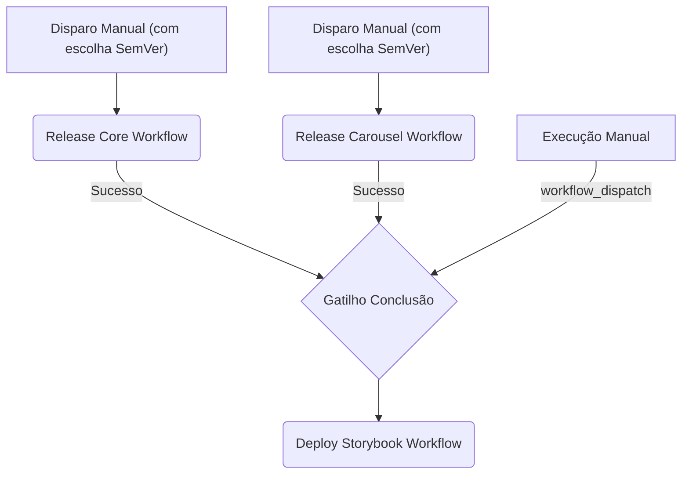

# Guia de Publicação e CI/CD (PUBLISHING.md)

Este documento descreve detalhadamente a arquitetura de Integração e Entrega Contínua (CI/CD) adotada neste design system, o fluxo de publicação dos pacotes `@ds/core` e `@ds/carousel` no NPM, o deploy da documentação (Storybook) no GitHub Pages e a configuração das integrações de notificações.

---

## 1. Arquitetura de Multi-Pipelines

Em vez de uma única pipeline monolítica, adotamos uma abordagem de **Multi-Pipelines** com múltiplos arquivos de workflow no GitHub Actions. Isso garante agilidade, resiliência e execuções otimizadas baseadas no Turborepo e no cache de dependências.



### 1.1 Disparadores (Triggers)

1. **Release Core (`release-core.yml`):**
   - **Gatilho:** Disparado manualmente via painel do GitHub Actions (`workflow_dispatch`).
   - **Inputs:** Requer que o desenvolvedor informe o tipo de incremento de versão SemVer (`patch`, `minor` ou `major`). O workflow aplica o incremento no `package.json`, compila o pacote, publica no NPM e, após a publicação bem-sucedida, realiza o commit e push do novo incremento diretamente de volta para a branch de origem.

2. **Release Carousel (`release-carousel.yml`):**
   - **Gatilho:** Disparado manualmente via painel do GitHub Actions (`workflow_dispatch`).
   - **Inputs:** Requer que o desenvolvedor informe o tipo de incremento de versão SemVer (`patch`, `minor` ou `major`). O workflow aplica o incremento no `package.json`, compila o pacote, publica no NPM e, após a publicação bem-sucedida, realiza o commit e push do novo incremento diretamente de volta para a branch de origem.

3. **Deploy Storybook (`deploy-storybook.yml`):**
   - **Gatilho Automático:** Conclusão bem-sucedida do workflow de qualquer um dos pacotes (`workflow_run` com conclusão `success`).
   - **Gatilho Manual:** Habilitado via `workflow_dispatch` permitindo atualizações de documentação a qualquer momento sem realizar novas releases de pacotes no NPM.

---

## 2. Estrutura de Build para Distribuição NPM

Antes de publicar no NPM, as bibliotecas devem ser empacotadas para que os consumidores finais possam utilizá-las tanto em ambientes que suportam ES Modules (ESM) quanto CommonJS (CJS).

### Configuração Necessária nos Pacotes

Para preparar o `@ds/core` e `@ds/carousel` para publicação, suas propriedades no `package.json` devem ser modificadas para:

```json
{
  "main": "./dist/index.js",
  "module": "./dist/index.mjs",
  "types": "./dist/index.d.ts",
  "files": ["dist"],
  "scripts": {
    "build": "tsup src/index.ts --format cjs,esm --dts --clean"
  }
}
```

- **`tsup`**: Recomendamos o uso da biblioteca `tsup` para empacotamento rápido, compilação de código TypeScript e geração de arquivos de declaração de tipos (`.d.ts`) com configuração mínima.

---

## 3. Autenticação e Publicação Automatizada (NPM)

A publicação real no NPM depende de um token de automação seguro associado à conta do NPM correspondente.

### 3.1 Configuração do Segredo

1. Acesse sua conta no [npmjs.com](https://www.npmjs.com/).
2. Gere um **Access Token** do tipo `Automation`.
3. No painel do seu repositório no GitHub, acesse _Settings -> Secrets and variables -> Actions_.
4. Crie um novo segredo (Secret) com o nome de `NPM_TOKEN` e cole o token gerado.

### 3.2 O Comando de Publicação

Nas pipelines de release, usamos o `pnpm` para publicar de forma isolada:

```bash
pnpm --filter <nome-do-pacote> publish --no-git-checks --access public
```

- `--no-git-checks`: Evita validações de git locais que possam travar o terminal do runner de CI.
- `--access public`: Necessário se o pacote estiver em um escopo público.

---

## 4. Deploy da Documentação (Storybook) no GitHub Pages

O Storybook é construído como um aplicativo estático e hospedado gratuitamente via GitHub Pages.

### 4.1 Permissões de Workflow

O workflow do Storybook exige permissões explícitas para assinar e gravar páginas:

```yaml
permissions:
  contents: read
  pages: write
  id-token: write
```

### 4.2 Ações Oficiais Utilizadas

Para garantir consistência e evitar problemas de empacotamento com branchs adicionais (como criar uma branch `gh-pages` e forçar pushes), o deploy usa as actions oficiais recomendadas pelo GitHub:

1. `actions/configure-pages@v5` - Prepara o ambiente do GitHub Pages.
2. `actions/upload-pages-artifact@v3` - Compacta a pasta de saída do build do Storybook (`packages/docs/storybook-static`).
3. `actions/deploy-pages@v4` - Realiza a entrega contínua do artefato no servidor do GitHub Pages do repositório.

---

## 5. Webhooks de Notificações (Slack, Discord, MS Teams)

A última etapa de todas as pipelines é o envio do status de conclusão (sucesso ou falha). Isso é implementado usando o comando `curl` padrão do Linux enviando payloads JSON para URLs de webhook secretas.

### Segredos do Repositório Aceitos

Você pode cadastrar as URLs de webhook conforme as plataformas que seu time utiliza:

- `SLACK_WEBHOOK_URL`
- `DISCORD_WEBHOOK_URL`
- `TEAMS_WEBHOOK_URL`

Se o segredo não estiver configurado no GitHub, a pipeline detecta a ausência e pula a notificação de forma silenciosa e segura, sem falhar o deploy.

### Estrutura de Payload do MS Teams

```bash
curl -H "Content-Type: application/json" \
     -d '{
       "type": "message",
       "attachments": [{
         "contentType": "application/vnd.microsoft.card.adaptive",
         "content": {
           "type": "AdaptiveCard",
           "body": [
             {"type": "TextBlock", "text": "🚀 Deploy Concluído", "weight": "bolder", "size": "medium"},
             {"type": "TextBlock", "text": "O pacote **'"$PACKAGE_NAME"'** foi publicado no NPM."}
           ],
           "$schema": "http://adaptivecards.io/schemas/adaptive-card.json",
           "version": "1.2"
         }
       }]
     }' $TEAMS_WEBHOOK_URL
```
