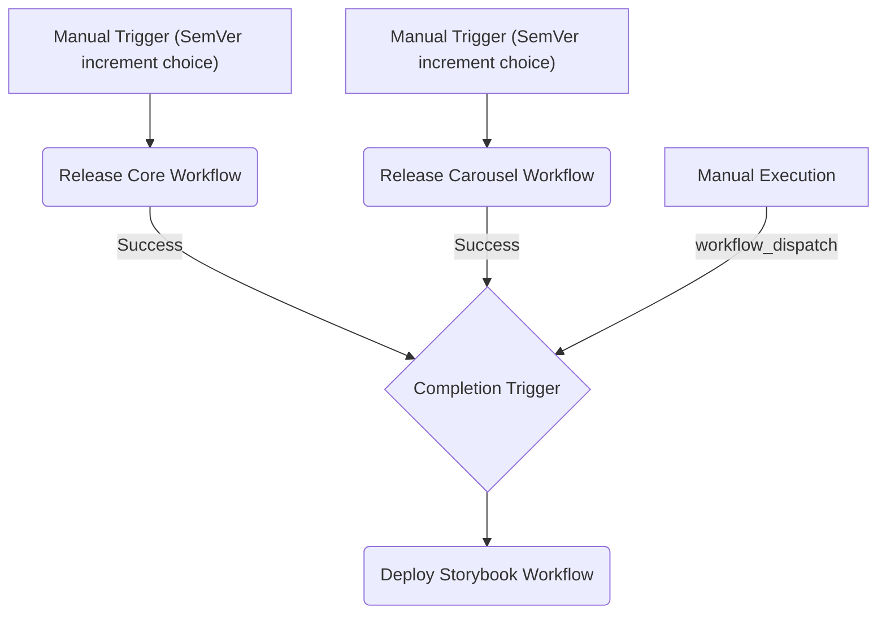

# Publishing and CI/CD Guide

This document describes in detail the Continuous Integration and Continuous Delivery (CI/CD) architecture adopted in this design system, the automatic Pull Request verification workflow, the NPM publishing workflow for the `@ds/core` and `@ds/carousel` packages, the Storybook deployment to GitHub Pages, the integrated visual regression testing, and the messaging notifications setup.

---

## 1. Multi-Pipeline Architecture

Rather than a single monolithic pipeline, we adopt a **Multi-Pipeline** approach using multiple workflow files in GitHub Actions. This guarantees speed, resilience, and optimized executions based on Turborepo and dependency caching.



### 1.1 Triggers and Workflow Behaviors

1. **Release Core (`release-core.yml`):**
   - **Trigger:** Manually triggered via the GitHub Actions dashboard (`workflow_dispatch`).
   - **Parameters:** Requires choosing the SemVer increment type (`patch`, `minor`, `major`).
   - **Flow:**
     1. Installation and caching via `pnpm`.
     2. Linting (`eslint`) and Unit & Accessibility tests (`vitest`).
     3. Checks BrowserStack credentials. If present, runs Visual Regression Tests (`test:visual`) using Playwright.
     4. Bumps the package version in `package.json` (`pnpm version --no-git-tag-version`).
     5. Builds the package using `tsup`.
     6. Publishes to NPM (if `NPM_TOKEN` is configured; otherwise, performs a dry-run).
     7. If successfully published, commits and pushes the version bump directly back to the origin branch.
     8. Notifies configured messaging platforms (Discord, Slack, Teams) of success or failure.

2. **Release Carousel (`release-carousel.yml`):**
   - **Trigger:** Manually triggered via the GitHub Actions dashboard (`workflow_dispatch`).
   - **Parameters:** Requires choosing the SemVer increment type (`patch`, `minor`, `major`).
   - **Flow:**
     1. Installation and caching via `pnpm`.
     2. Builds internal monorepo dependencies (e.g., `@ds/core`).
     3. Linting (`eslint`) and Unit & Accessibility tests (`vitest`).
     4. Checks BrowserStack credentials and runs Visual Regression Tests using Playwright.
     5. Bumps the package version in `package.json`.
     6. Builds the package using `tsup`.
     7. Publishes to NPM (with dry-run fallback if `NPM_TOKEN` is missing).
     8. Commits and pushes the version bump.
     9. Status notifications.

3. **Deploy Storybook (`deploy-storybook.yml`):**
   - **Automatic Trigger:** Triggered upon the successful completion of either release workflow above (`workflow_run` with a `success` conclusion).
   - **Manual Trigger:** Enabled via `workflow_dispatch` for fast documentation-only updates.
   - **Flow:**
     1. Installs dependencies and builds the entire monorepo (`pnpm build`).
     2. Builds the static Storybook site (`storybook-static`).
     3. Deploys to GitHub Pages using official GitHub actions.
     4. Sends notifications with a direct link to the published documentation environment.

4. **Pull Request Verification (`pr.yml`):**
   - **Automatic Trigger:** Automatically triggered on any Pull Request targeting the `main` or `master` branches, as well as on manual trigger (`workflow_dispatch`).
   - **Flow (Executes parallel jobs):**
     - **Job `lint-and-build`:** Sets up Node.js 22.20.0 and pnpm 11.2.2, installs dependencies, checks linting rules (`eslint`), checks code formatting using Prettier, and compiles all packages in the monorepo.
     - **Job `unit-tests`:** Installs dependencies and executes unit and accessibility tests (`vitest`).
     - **Job `visual-tests`:** Verifies if BrowserStack credentials are present in secrets. If available, builds the monorepo and executes Playwright visual regression tests (`pnpm --filter @ds/docs test:visual`) to check for visual changes.

---

## 2. Build Structure for NPM Distribution

To allow packages to be imported in both modern ES Modules (ESM) environments and legacy CommonJS (CJS) setups, we use `tsup` as our bundler.

### 2.1 `package.json` Configuration

The `@ds/core` and `@ds/carousel` packages expose the following export fields:

```json
{
  "main": "./dist/index.js",
  "module": "./dist/index.mjs",
  "types": "./dist/index.d.ts",
  "files": ["dist"],
  "scripts": {
    "build": "tsup"
  }
}
```

### 2.2 `tsup.config.ts` Configuration

Since we use **SCSS Modules** (without CSS-in-JS or TailwindCSS), it is crucial that the CSS processor generates the correct output files. Each package contains a `tsup.config.ts` file:

```typescript
import { defineConfig } from 'tsup'
import { sassPlugin } from 'esbuild-sass-plugin'

export default defineConfig({
  entry: ['src/index.ts'],
  format: ['cjs', 'esm'],
  dts: true,
  clean: true,
  esbuildPlugins: [
    sassPlugin({
      type: 'local-css',
    }),
  ],
})
```

> [!IMPORTANT]
> The `esbuild-sass-plugin` with `type: 'local-css'` configuration is mandatory for `.module.scss` files to be correctly compiled as local CSS Modules and integrated into the final package build.

---

## 3. Authentication and Automated Publishing (NPM)

Actual publishing to NPM requires a secure automation token.

### 3.1 Secret Configuration

1. On [npmjs.com](https://www.npmjs.com/), generate an **Access Token** of type `Automation`.
2. In GitHub, navigate to _Settings -> Secrets and variables -> Actions_.
3. Create a secret named `NPM_TOKEN` and paste the token value.

### 3.2 The Publishing Command

The pipeline publishes packages using the following command:

```bash
pnpm --filter <package-name> publish --no-git-checks --access public
```

- `--no-git-checks`: Avoids local git state validations that could block the non-interactive execution on the CI runner.
- `--access public`: Required for scoped packages published publicly.

> [!NOTE]
> If the `NPM_TOKEN` secret is not configured or is missing, the pipeline will only run code linting, tests, and build steps (Dry-run), displaying a friendly warning without interrupting or failing the workflow.

---

## 4. Deploying Documentation (Storybook) to GitHub Pages

Storybook is built statically and hosted directly on the GitHub Pages site associated with the repository.

### 4.1 Workflow Permissions

The deployment workflow requires explicit permissions to sign and write page artifacts:

```yaml
permissions:
  contents: read
  pages: write
  id-token: write
```

### 4.2 Deployment Concurrency

To avoid race conditions on concurrent page updates, deployment concurrency is configured as:

```yaml
concurrency:
  group: 'pages'
  cancel-in-progress: false
```

### 4.3 Official GitHub Actions Used

Rather than using legacy force-pushes to a target branch (e.g. `gh-pages`), the deployment utilizes official actions:

1. `actions/configure-pages@v5`: Configures Pages on the runner.
2. `actions/upload-pages-artifact@v3`: Archives the Storybook output directory (`packages/docs/storybook-static`).
3. `actions/deploy-pages@v4`: Safely deploys the archived artifact to GitHub Pages servers.

---

## 5. Notification Webhooks (Slack, Discord, MS Teams)

At the completion of any pipeline (whether a success or failure), notification payloads are sent via `curl` to the configured platforms.

### 5.1 Supported Webhook Secrets

The repository supports the following secret variables for webhook notifications:

- `SLACK_WEBHOOK_URL`
- `DISCORD_WEBHOOK_URL`
- `TEAMS_WEBHOOK_URL`

If no webhook secrets are configured, the pipeline safely and silently skips the notification steps.

### 5.2 MS Teams Adaptive Card Structure

Microsoft Teams notifications utilize the **Adaptive Cards** format (v1.2) structured as shown in the example below:

```bash
curl -H "Content-Type: application/json" \
     -d '{
       "type": "message",
       "attachments": [{
         "contentType": "application/vnd.microsoft.card.adaptive",
         "content": {
           "type": "AdaptiveCard",
           "body": [
             {"type": "TextBlock", "text": "🚀 Deployment Completed", "weight": "bolder", "size": "medium"},
             {"type": "TextBlock", "text": "The package **'"$PACKAGE_NAME"'** has been published to NPM."}
           ],
           "$schema": "http://adaptivecards.io/schemas/adaptive-card.json",
           "version": "1.2"
         }
       }]
     }' $TEAMS_WEBHOOK_URL
```
