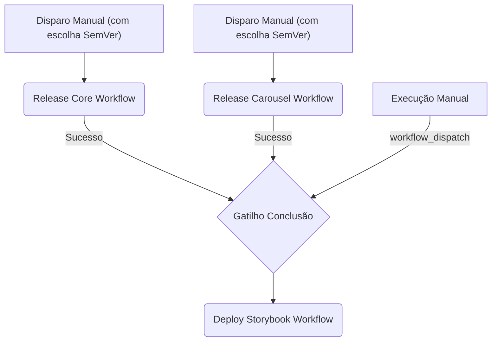

# Guia de Publicação e CI/CD

Este documento descreve detalhadamente a arquitetura de Integração e Entrega Contínua (CI/CD) adotada neste design system, o workflow automático de verificação de Pull Requests, o fluxo de publicação dos pacotes `@rafacdomin/ds-core` e `@rafacdomin/ds-carousel` no NPM, o deploy do Storybook no GitHub Pages, os testes integrados de regressão visual e a configuração de notificações.

---

## 1. Arquitetura de Multi-Pipelines

Em vez de uma única pipeline monolítica, adotamos uma abordagem de **Multi-Pipelines** com múltiplos arquivos de workflow no GitHub Actions. Isso garante flexibilidade, rapidez e execuções otimizadas baseadas no cache de dependências e no Turborepo.



### 1.1 Gatilhos e Comportamento dos Workflows

1. **Release Core (`release-core.yml`):**
   - **Gatilho:** Disparado manualmente via painel do GitHub Actions (`workflow_dispatch`).
   - **Parâmetros:** Exige a escolha do incremento SemVer (`patch`, `minor`, `major`).
   - **Fluxo:**
     1. Instalação e cache com `pnpm`.
     2. Linting (`eslint`) e Testes unitários/acessibilidade (`vitest`).
     3. Verificação de credenciais do BrowserStack. Se presentes, executa os testes de regressão visual (`test:visual`) com Playwright.
     4. Bump de versão no `package.json` (`pnpm version --no-git-tag-version`).
     5. Build do pacote com `tsup`.
     6. Publicação no NPM (se `NPM_TOKEN` estiver configurado; caso contrário, executa dry-run).
     7. Se publicado com sucesso, commita e faz push do incremento diretamente de volta para a branch de origem.
     8. Notifica plataformas de mensagens (Discord, Slack, Teams) sobre o sucesso ou falha.

2. **Release Carousel (`release-carousel.yml`):**
   - **Gatilho:** Disparado manualmente via painel do GitHub Actions (`workflow_dispatch`).
   - **Parâmetros:** Exige a escolha do incremento SemVer (`patch`, `minor`, `major`).
   - **Fluxo:**
     1. Instalação e cache com `pnpm`.
     2. Build das dependências internas monorepo (ex: `@rafacdomin/ds-core`).
     3. Linting (`eslint`) e Testes unitários/acessibilidade (`vitest`).
     4. Verificação de credenciais do BrowserStack e execução dos testes de regressão visual com Playwright.
     5. Bump de versão no `package.json`.
     6. Build do pacote com `tsup`.
     7. Publicação no NPM (com dry-run fallback se `NPM_TOKEN` estiver ausente).
     8. Commit e push do incremento de versão.
     9. Notificações de status.

3. **Deploy Storybook (`deploy-storybook.yml`):**
   - **Gatilho Automático:** Conclusão bem-sucedida de qualquer workflow de release acima (`workflow_run` com conclusão `success`).
   - **Gatilho Manual:** Habilitado via `workflow_dispatch` para atualização rápida da documentação.
   - **Fluxo:**
     1. Instalação de dependências e build completo do monorepo (`pnpm build`).
     2. Geração estática do Storybook (`storybook-static`).
     3. Deploy para o GitHub Pages utilizando as actions oficiais.
     4. Notificações com link direto para o ambiente publicado.

4. **Verificação de Pull Request (`pr.yml`):**
   - **Gatilho Automático:** Disparado automaticamente em qualquer Pull Request destinado às branches `main` ou `master`, bem como por disparo manual (`workflow_dispatch`).
   - **Fluxo (Executa jobs paralelos):**
     - **Job `lint-and-build`:** Prepara o ambiente com Node.js 22.20.0 e pnpm 11.2.2, instala as dependências, valida as regras de lint (`eslint`), checa a formatação de código com Prettier e compila todos os pacotes do monorepo.
     - **Job `unit-tests`:** Instala dependências e roda a suíte completa de testes unitários e de acessibilidade (`vitest`).
     - **Job `visual-tests`:** Verifica se as credenciais do BrowserStack estão presentes. Se disponíveis, compila o Storybook e roda os testes de regressão visual do Playwright (`pnpm --filter @rafacdomin/ds-docs test:visual`) para validar eventuais alterações visuais.

---

## 2. Estrutura de Build para Distribuição NPM

Para que os pacotes possam ser importados tanto em ambientes modernos baseados em ES Modules (ESM) quanto legados baseados em CommonJS (CJS), utilizamos o `tsup` como bundler de build.

### 2.1 Configuração do `package.json`

Os pacotes `@rafacdomin/ds-core` e `@rafacdomin/ds-carousel` expõem os seguintes campos de exportação:

```json
{
  "main": "./dist/index.js",
  "module": "./dist/index.mjs",
  "types": "./dist/index.d.ts",
  "files": ["dist"],
  "scripts": {
    "build": "tsup"
  }
}
```

### 2.2 Configuração do `tsup.config.ts`

Como utilizamos **SCSS Modules** (sem CSS-in-JS ou Tailwind), é fundamental que o processador do CSS gere os arquivos corretos. Cada pacote contém um arquivo `tsup.config.ts`:

```typescript
import { defineConfig } from 'tsup'
import { sassPlugin } from 'esbuild-sass-plugin'

export default defineConfig({
  entry: ['src/index.ts'],
  format: ['cjs', 'esm'],
  dts: true,
  clean: true,
  esbuildPlugins: [
    sassPlugin({
      type: 'local-css',
    }),
  ],
})
```

> [!IMPORTANT]
> O plugin `esbuild-sass-plugin` com a configuração `type: 'local-css'` é obrigatório para que os arquivos `.module.scss` sejam compilados como CSS Modules locais e integrados corretamente na build do pacote.

---

## 3. Autenticação e Publicação Automatizada (NPM)

A publicação real no NPM depende de um token de automação seguro da organização/conta.

### 3.1 Configuração do Segredo

1. No [npmjs.com](https://www.npmjs.com/), gere um **Access Token** do tipo `Automation`.
2. No GitHub, vá em _Settings -> Secrets and variables -> Actions_.
3. Crie uma secret chamada `NPM_TOKEN` com o valor do token.

### 3.2 O Comando de Publicação

A pipeline realiza a publicação com o seguinte comando:

```bash
pnpm --filter <nome-do-pacote> publish --no-git-checks --access public
```

- `--no-git-checks`: Evita validações de estado git locais que possam quebrar a execução não-interativa do runner de CI.
- `--access public`: Necessário para pacotes com escopo de organização pública.

> [!NOTE]
> Se o segredo `NPM_TOKEN` não for configurado ou estiver ausente, o pipeline executará apenas a verificação, testes e build (Dry-run), exibindo um aviso amigável sem interromper ou quebrar o fluxo.

---

## 4. Deploy da Documentação (Storybook) no GitHub Pages

O Storybook é construído estaticamente e hospedado diretamente na aba do GitHub Pages associada ao repositório.

### 4.1 Permissões do Workflow

O workflow exige permissões explícitas para assinar e gravar artefatos de páginas:

```yaml
permissions:
  contents: read
  pages: write
  id-token: write
```

### 4.2 Concorrência de Deploy

Para evitar condições de corrida em builds concorrentes, a concorrência é configurada como:

```yaml
concurrency:
  group: 'pages'
  cancel-in-progress: false
```

### 4.3 Actions Oficiais Utilizadas

O deploy evita pushes forçados para branches específicas (ex: `gh-pages`) e usa as seguintes actions oficiais:

1. `actions/configure-pages@v5`: Prepara o ambiente do Pages no runner.
2. `actions/upload-pages-artifact@v3`: Compacta o diretório de saída do build do Storybook (`packages/docs/storybook-static`).
3. `actions/deploy-pages@v4`: Publica o artefato de forma segura nos servidores do GitHub Pages.

---

## 5. Webhooks de Notificações (Slack, Discord, MS Teams)

Ao término de qualquer uma das pipelines (seja sucesso ou falha), notificações informando o resultado são disparadas via `curl` para as plataformas configuradas.

### 5.1 Secrets de Webhooks Suportadas

O repositório aceita as seguintes variáveis secretas para notificações:

- `SLACK_WEBHOOK_URL`
- `DISCORD_WEBHOOK_URL`
- `TEAMS_WEBHOOK_URL`

Se nenhuma secret estiver definida, o pipeline pula essa etapa silenciosa e amigavelmente.

### 5.2 Estrutura de Adaptive Card do MS Teams

As notificações do Microsoft Teams utilizam o formato **Adaptive Cards** v1.2 estruturado conforme o exemplo abaixo:

```bash
curl -H "Content-Type: application/json" \
     -d '{
       "type": "message",
       "attachments": [{
         "contentType": "application/vnd.microsoft.card.adaptive",
         "content": {
           "type": "AdaptiveCard",
           "body": [
             {"type": "TextBlock", "text": "🚀 Deploy Concluído", "weight": "bolder", "size": "medium"},
             {"type": "TextBlock", "text": "O pacote **'"$PACKAGE_NAME"'** foi publicado no NPM."}
           ],
           "$schema": "http://adaptivecards.io/schemas/adaptive-card.json",
           "version": "1.2"
         }
       }]
     }' $TEAMS_WEBHOOK_URL
```
