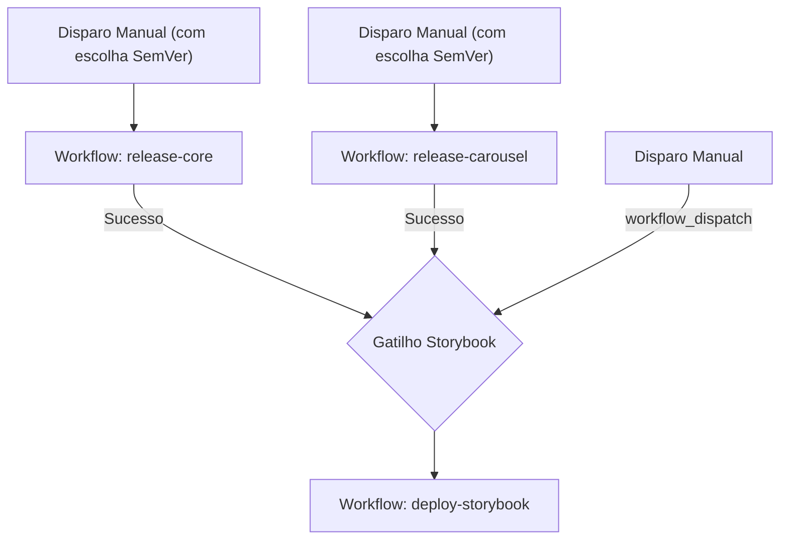

# Especificação Geral — CI/CD e Publicação (SPEC.md)

Este documento descreve a especificação da arquitetura de integração e entrega contínua (CI/CD), publicação dos pacotes do design system no NPM (`@ds/core` e `@ds/carousel`) e publicação do Storybook no GitHub Pages.

---

## 1. Visão Geral

O objetivo desta especificação é automatizar o fluxo de verificação, build, publicação e notificação do design system.

Adotaremos uma abordagem de **Multi-Pipelines** no GitHub Actions, onde cada pacote possui sua própria esteira de publicação, e a documentação (Storybook) é atualizada automaticamente após qualquer publicação de biblioteca ou manualmente por demanda.

---

## 2. Stack Técnica de CI/CD

- **Orquestrador de Workflows:** GitHub Actions.
- **Gerenciador de Pacotes:** `pnpm` Workspaces (v11.2.2).
- **Orquestração de Tasks:** Turborepo (para paralelizar lint, testes e builds).
- **Publicação de Pacotes:** Registro do NPM (pacotes públicos `@ds/core` e `@ds/carousel`).
- **Hospedagem da Documentação:** GitHub Pages (usando deploys nativos).
- **Notificações:** Webhooks via HTTP POST (`curl`) integrados ao Slack, Discord e Microsoft Teams.

---

## 3. Desenho de Fluxo de Execução



---

## 4. Arquitetura de Multi-Pipelines no GitHub Actions

Em vez de uma única pipeline monolítica, o repositório é configurado com três pipelines independentes para garantir agilidade e isolamento de falhas:

### 4.1 Release Core (`.github/workflows/release-core.yml`)

Responsável por validar e publicar o pacote `@ds/core`.

- **Gatilhos (Triggers):**
  - **Apenas disparo manual (`workflow_dispatch`).**
  - **Inputs do Workflow:**
    - `version_increment` (Choice: `patch`, `minor`, `major`, padrão: `patch`) - Define o tipo de incremento SemVer que será aplicado ao pacote.
- **Etapas da Pipeline:**
  1. **Install:** Checkout do código, configuração do Node.js (versão versão 20.19.0), cache de dependências e `pnpm install --frozen-lockfile`.
  2. **Test:** Execução dos testes unitários e de acessibilidade via `pnpm --filter @ds/core test` e `pnpm --filter @ds/core lint`.
  3. **Visual Regression Test:** Build estática do Storybook e execução dos testes do Playwright (`pnpm --filter @ds/docs test:visual`, que roda no Browserstack se as credenciais estiverem configuradas nos segredos do repositório, ou localmente caso contrário).
  4. **Bump Version:** Incrementa a versão do pacote no `package.json` de acordo com a seleção (ex: `pnpm --filter @ds/core version ${{ github.event.inputs.version_increment }} --no-git-tag-version`).
  5. **Build:** Compilação dos componentes do `@ds/core` para distribuição pública (ESM/CJS).
  6. **Publication:** Publicação no NPM (`pnpm --filter @ds/core publish --no-git-checks --access public`) autenticada por meio da variável `NPM_TOKEN`.
  7. **Commit & Push:** Realiza commit e push automático do novo incremento de versão de volta para o repositório.
  8. **Notification:** Envio de payload via webhook informando o status final da execução.

### 4.2 Release Carousel (`.github/workflows/release-carousel.yml`)

Responsável por validar e publicar o pacote `@ds/carousel`.

- **Gatilhos (Triggers):**
  - **Apenas disparo manual (`workflow_dispatch`).**
  - **Inputs do Workflow:**
    - `version_increment` (Choice: `patch`, `minor`, `major`, padrão: `patch`) - Define o tipo de incremento SemVer que será aplicado ao pacote.
- **Etapas da Pipeline:**
  1. **Install:** Instalação das dependências com cache.
  2. **Test:** Execução de testes unitários do `@ds/carousel` e linter.
  3. **Visual Regression Test:** Execução dos testes visuais do Playwright para os stories do carrossel.
  4. **Bump Version:** Incrementa a versão do pacote no `package.json` de acordo com a seleção (ex: `pnpm --filter @ds/carousel version ${{ github.event.inputs.version_increment }} --no-git-tag-version`).
  5. **Build:** Compilação da build de distribuição do `@ds/carousel`.
  6. **Publication:** Publicação no NPM usando o segredo `NPM_TOKEN`.
  7. **Commit & Push:** Realiza commit e push automático do novo incremento de versão de volta para o repositório.
  8. **Notification:** Notificação de status final.

### 4.3 Deploy Storybook (`.github/workflows/deploy-storybook.yml`)

Responsável pelo build e publicação da documentação interativa.

- **Gatilhos (Triggers):**
  - Conclusão bem-sucedida dos workflows "Release Core Package" ou "Release Carousel Package" (via evento `workflow_run`).
  - Disparo manual (`workflow_dispatch`).
- **Permissões GitHub Requeridas:**
  - `pages: write` e `id-token: write` para deploy nativo no GitHub Pages.
- **Etapas da Pipeline:**
  1. **Install:** Setup inicial do Node.js, pnpm e dependências.
  2. **Build:** Geração da build estática de todo o monorepo (`pnpm build`) para garantir links de dependência, seguida por `pnpm --filter @ds/docs build-storybook` para compilar o Storybook estático na pasta `packages/docs/storybook-static/`.
  3. **Publication:** Upload do artefato e publicação no GitHub Pages através dos actions oficiais:
     - `actions/configure-pages@v5`
     - `actions/upload-pages-artifact@v3` (apontando para `packages/docs/storybook-static`)
     - `actions/deploy-pages@v4` (que retorna a URL do deploy na variável `${{ steps.deployment.outputs.page_url }}`).
  4. **Notification:** Notificação de sucesso incluindo a URL direta da documentação publicada.

---

## 5. Preparação dos Pacotes para Publicação no NPM

Atualmente, as importações entre pacotes no monorepo apontam diretamente para o código-fonte em TypeScript (`src/index.ts`). Para a publicação NPM, os pacotes devem ser compilados para produção em formatos compatíveis com os navegadores e ambientes Node.js (ESM e CommonJS) e com declarações de tipos (`.d.ts`).

### Requisitos de Configuração no `package.json`

Cada pacote a ser publicado (`core` e `carousel`) deve conter as seguintes definições para produção:

```json
{
  "main": "./dist/index.js",
  "module": "./dist/index.mjs",
  "types": "./dist/index.d.ts",
  "files": ["dist"],
  "scripts": {
    "build": "tsup src/index.ts --format cjs,esm --dts --clean"
  }
}
```

_Nota: Recomenda-se o uso do `tsup` (um compilador rápido baseado no `esbuild`) para gerar as builds de produção automaticamente com zero esforço de configuração._

### Autenticação NPM

Para permitir a publicação automatizada pelas pipelines, deve ser gerado um token do tipo **Automation** no console do NPM e cadastrado no repositório do GitHub com a chave `NPM_TOKEN` (em _Settings -> Secrets and variables -> Actions_).

No pipeline, o pnpm publica o pacote com o comando:

```bash
pnpm -r publish --no-git-checks --access public
```

---

## 6. Configuração de Notificações via Webhook

As notificações utilizam o utilitário nativo `curl` no terminal Linux do GitHub Actions. A pipeline enviará dados estruturados em JSON baseados em variáveis de ambiente secretas:

- **Segredos Disponíveis:** `SLACK_WEBHOOK_URL`, `DISCORD_WEBHOOK_URL`, `TEAMS_WEBHOOK_URL`.
- **Regra de Sucesso/Falha:** As requisições ocorrem de forma condicional (`if: success()` ou `if: failure()`). Se a URL secreta não estiver configurada no repositório, o passo é pulado com segurança sem interromper o pipeline.

### Payloads de Exemplo (Formatados para curl):

#### A. Slack

```bash
curl -X POST -H 'Content-type: application/json' \
     --data '{"text": "✅ *Deploy Sucesso:* Pacote `'"$PACKAGE_NAME"'` publicado!\n*Job:* <https://github.com/'"$GITHUB_REPOSITORY"'/actions/runs/'"$GITHUB_RUN_ID"'|Visualizar no GitHub>"}' \
     $SLACK_WEBHOOK_URL
```

#### B. Discord

```bash
curl -H "Content-Type: application/json" \
     -X POST \
     -d '{"content": "🎉 **Sucesso no deploy!** O Storybook do Design System foi publicado.\n🔗 URL: '"$DEPLOY_URL"'"}' \
     $DISCORD_WEBHOOK_URL
```

#### C. Microsoft Teams (Adaptive Card)

```bash
curl -H "Content-Type: application/json" \
     -d '{
       "type": "message",
       "attachments": [{
         "contentType": "application/vnd.microsoft.card.adaptive",
         "content": {
           "type": "AdaptiveCard",
           "body": [
             {"type": "TextBlock", "text": "🚀 Pipeline Concluída com Sucesso!", "weight": "bolder", "size": "medium"},
             {"type": "TextBlock", "text": "O pacote **'"$PACKAGE_NAME"'** foi publicado no NPM."}
           ],
           "$schema": "http://adaptivecards.io/schemas/adaptive-card.json",
           "version": "1.2"
         }
       }]
     }' $TEAMS_WEBHOOK_URL
```

---

## 7. Critérios de Conclusão (Critérios de Done da Pipeline)

1. Os scripts e caminhos definidos nos workflows correspondem exatamente à estrutura de pastas do monorepo.
2. O workflow do Storybook está perfeitamente amarrado ao resultado positivo dos workflows individuais de biblioteca.
3. Não há tokens expostos; toda a infraestrutura se apoia estritamente no contexto `${{ secrets.* }}`.
4. O deploy do Storybook utiliza actions oficiais suportados pela infraestrutura nativa do GitHub Pages.
5. As etapas de publicação no NPM e as chamadas de notificação de webhook possuem tratamento para que a pipeline não quebre caso os segredos não estejam presentes no repositório (graceful degradation).

---

## 8. Entregáveis de Documentação do Repositório

Para consolidar e expor a arquitetura de CI/CD para desenvolvedores e agentes autônomos, a implementação desta especificação exige a criação/atualização dos seguintes documentos no repositório:

1. **Guia de Publicação (`references/PUBLISHING.md`):**
   - Criação de um novo arquivo detalhando o fluxo de publicação das bibliotecas (`@ds/core`, `@ds/carousel`), empacotamento com `tsup`, tokens de segurança, deploy do Storybook no GitHub Pages e payloads de notificação para Teams, Slack e Discord.
2. **Diretrizes para Agentes (`AGENTS.md`):**
   - Atualização do arquivo com links para `references/PUBLISHING.md` e regras claras instruindo agentes de IA a não modificarem as pipelines ou builds do design system sem consentimento prévio.
3. **Leias-me Principais (`README.md` e `README_PT-BR.md`):**
   - Adição de uma seção específica sobre CI/CD e Publicação (em ambos os idiomas) mapeando os fluxos e apontando para a documentação técnica oficial.
4. **Guias de Contribuição (`CONTRIBUTING.md` e `CONTRIBUTING_PT-BR.md`):**
   - Integração das boas práticas de Integração Contínua e publicação para orientar os desenvolvedores contribuintes.
