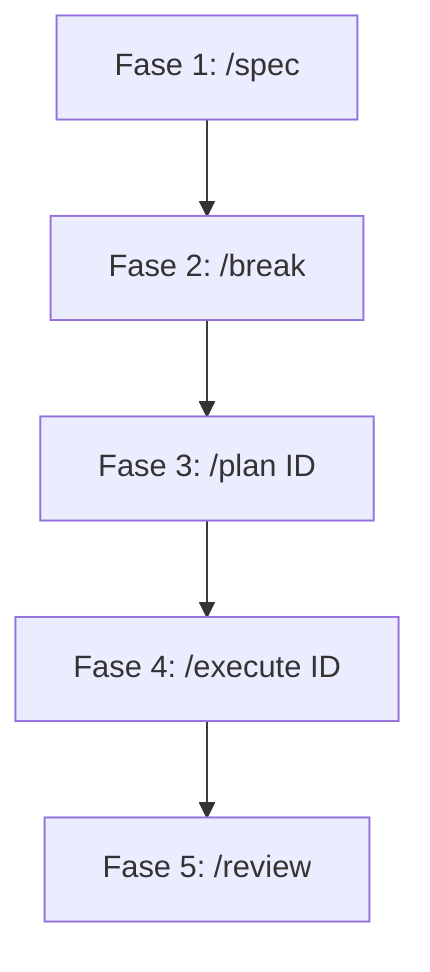

# Ciclo de Desenvolvimento: Spec-Driven Development (WORKFLOW.md)

Este documento detalha o ciclo de vida de desenvolvimento adotado no projeto para a criação de componentes e configurações utilizando o Antigravity CLI e a metodologia **Spec-Driven Development**.

O fluxo é dividido em 4 fases sequenciais e obrigatórias: **Spec → Break → Plan → Execute**.

---

## Fluxo de Desenvolvimento

---

## Fase 1: Especificação (`/spec`)

**Objetivo:** Consolidar os requisitos e regras do design system no arquivo principal `SPEC.md` e em `references/`.

1.  **Ação:** Executar a barra-comando `/spec`.
2.  **O que o Agente faz:**
    - Lê o diretório `references/` e as especificações fornecidas.
    - Faz perguntas de alinhamento técnico/visual.
    - Escreve ou atualiza o arquivo `SPEC.md` na raiz.
3.  **Resultado Esperado:** Um `SPEC.md` aprovado pelo desenvolvedor contendo a visão de todos os componentes, tokens de design e arquitetura de pastas.

---

## Fase 2: Decomposição (`/break`)

**Objetivo:** Converter o `SPEC.md` em tarefas granulares e rastreáveis na forma de issues executáveis.

1.  **Ação:** Executar a barra-comando `/break`.
2.  **O que o Agente faz:**
    - Lê o `SPEC.md` validado.
    - Cria uma pasta `.epic/issues/` (se não existir).
    - Gera arquivos markdown individuais numerados por issue (ex: `001_monorepo_setup.md`, `002_design_tokens.md`, `003_button.md`).
    - Cria um arquivo sumário `.epic/EPIC_DESIGN_SYSTEM.md` listando todas as issues, status e ordem de dependências.
3.  **Resultado Esperado:** Uma lista clara de tarefas numeradas, prontas para serem refinadas e implementadas.

---

## Fase 3: Refinamento e Pesquisa (`/plan [ID]`)

**Objetivo:** Pesquisar as melhores práticas do componente específico, definir APIs exatas e montar um checklist de implementação.

1.  **Ação:** Executar a barra-comando `/plan 004` (por exemplo, para planejar o botão).
2.  **O que o Agente faz:**
    - Lê a especificação da issue correspondente.
    - Pesquisa implementações de referência na web (Radix, IBM Carbon, shadcn/ui).
    - Pesquisa padrões de navegação por teclado e semântica ARIA para o componente.
    - Atualiza a issue em `.epic/issues/[ID]*.md` adicionando seções de **Pesquisa**, **Pseudocódigo / Arquitetura**, **Decisões Técnicas** e um **Checklist de Implementação** detalhado (15-20 itens).
3.  **Resultado Esperado:** Um plano técnico granular pronto para a execução (você nunca deve ir para o execute sem planejar primeiro).

---

## Fase 4: Implementação (`/execute [ID]`)

**Objetivo:** Codificar o componente seguindo TDD (Test-Driven Development) e os padrões rígidos de arquivos do design system.

1.  **Ação:** Executar a barra-comando `/execute 004`.
2.  **O que o Agente faz:**
    - Segue estritamente as regras do `AGENTS.md`.
    - Foca em TDD, criando e implementando os arquivos na seguinte ordem padrão:
      1.  **Testes unitários e a11y:** `ComponentName.test.tsx` no pacote `@rafacdomin/ds-core` (deve rodar e falhar inicialmente).
      2.  **Tipagem TypeScript:** Definição da interface de props.
      3.  **Implementação do Componente:** `ComponentName.tsx` com `forwardRef` e `displayName`.
      4.  **Estilos SCSS Modules:** `ComponentName.module.scss` usando apenas tokens do design system.
      5.  **Export:** Inclusão no `index.ts` de exportação do componente.
      6.  **Stories do Storybook:** `packages/docs/src/stories/ComponentName.stories.tsx` no pacote `@rafacdomin/ds-docs`.
    - Executa os testes locais para validar a conclusão.
3.  **Resultado Esperado:** Componente finalizado seguindo os Critérios de Done.

---

## Fase 5: Revisão (`/review`)

**Objetivo:** Avaliar o código implementado contra as regras do `AGENTS.md` e guias em `references/`.

1.  **Ação:** Executar a barra-comando `/review`.
2.  **O que o Agente faz:**
    - Verifica se há uso proibido de Tailwind, CSS-in-JS, strings literais no SCSS, type alias para componentes, `any` no TypeScript, etc.
    - Gera um relatório de conformidade.
3.  **Resultado Esperado:** Garantia de que a base de código permanece limpa, consistente e padronizada.
